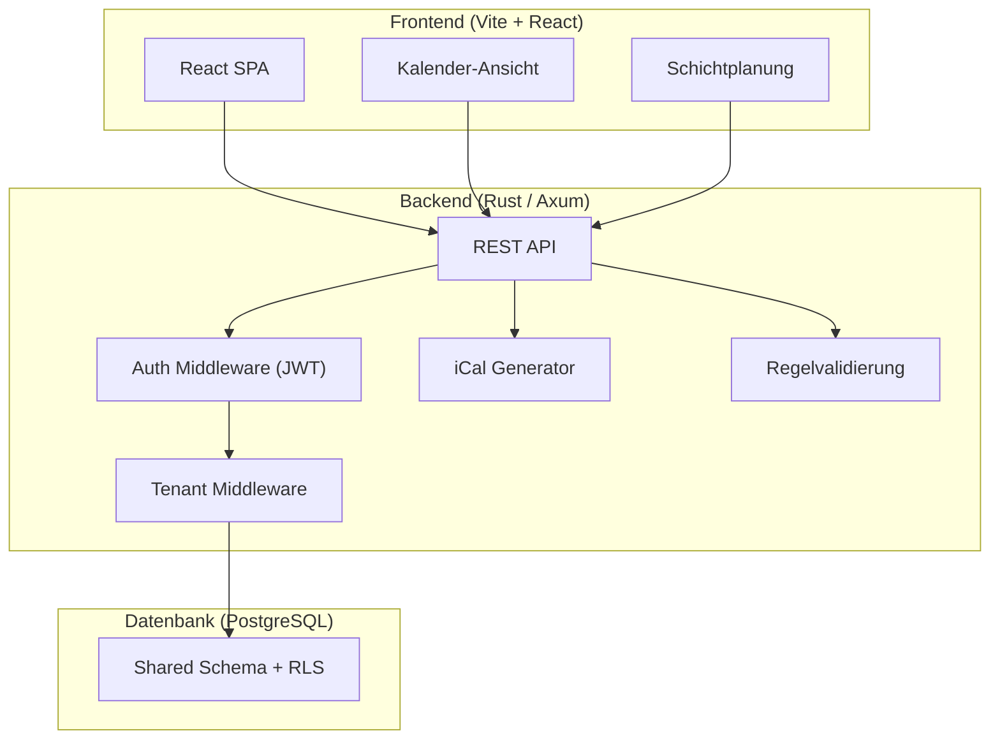
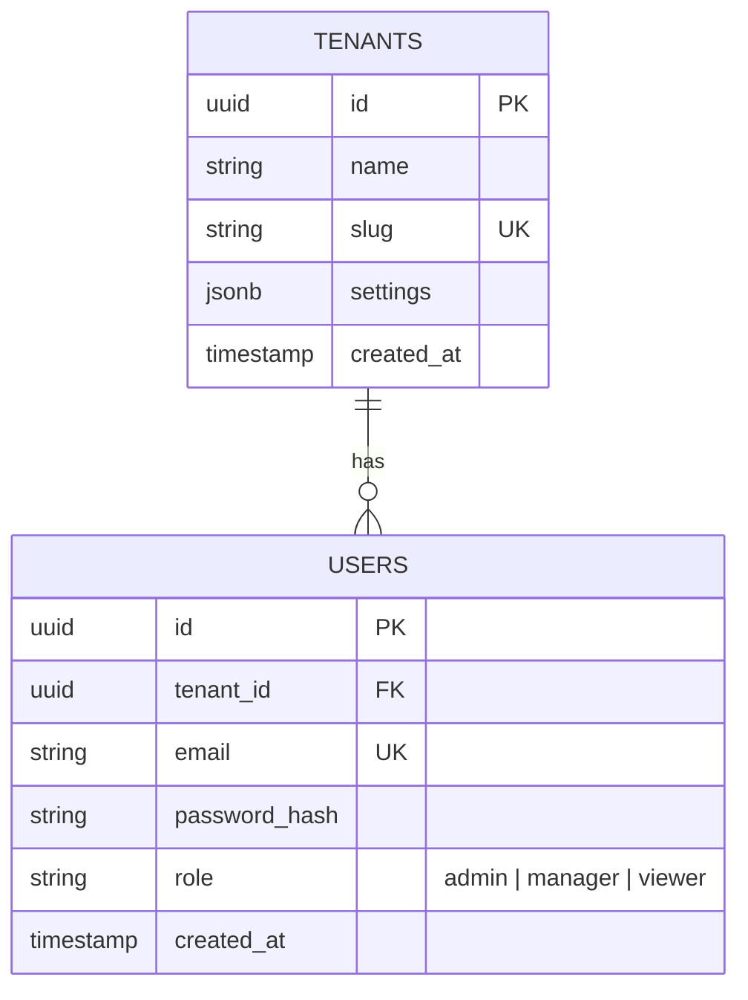
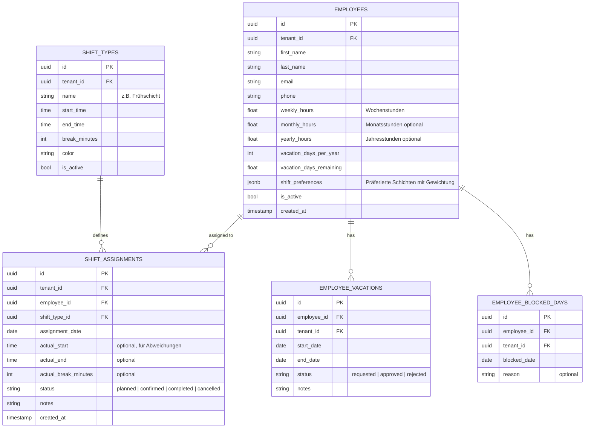

# SimpleStaff – Schichtbesetzungs- und Personalplanungstool

Web-basiertes, multi-mandantenfähiges Tool zur Schichtplanung mit Rust-Backend und modernem Web-Frontend.

---

## User Review Required

> [!IMPORTANT]
> **Frontend-Technologie:** Der Plan sieht ein **SPA mit Vite + React (TypeScript)** vor. Alternativ wäre ein reines Vanilla-JS-Frontend möglich, aber React bietet deutlich bessere Handhabbarkeit für komplexe Kalender-UIs und State-Management. Ist React akzeptabel?

> [!IMPORTANT]
> **Datenbank:** Der Plan verwendet **PostgreSQL** mit Row-Level Security für Multi-Mandanten-Isolation. Dies ist der Gold-Standard für SaaS-Anwendungen. Alternative wäre SQLite (einfacher, aber weniger geeignet für Multi-Tenancy). Ist PostgreSQL akzeptabel?

> [!WARNING]
> **Scope:** Dies ist ein umfangreiches Projekt. Ich schlage vor, in **Phasen** zu arbeiten – zuerst das Backend mit API, dann das Frontend. Die erste lauffähige Version (MVP) umfasst Mandantenverwaltung, Mitarbeiter-CRUD, Schichtdefinition, Schichtplanung und Kalender-Export. Erweiterte Features (Auto-Scheduling, Konflikterkennung, Reporting) kommen in Phase 2.

## Open Questions

## Entschiedene Fragen

- **Authentifizierung:** Eigenes JWT-Auth-System. Super-Admin wird über `.env` konfiguriert (fest hinterlegt). Manager-Rolle pro Mandant erhält Nutzerverwaltung für den eigenen Mandanten. Keycloak-Integration bleibt als spätere Option.
- **Sprache der UI:** Deutsch + Englisch (i18n mit zwei Sprachen)
- **Regelvalidierung:** Pausenregelungen und Arbeitszeitgrenzen sind **pro Mandant parametrierbar** (über Tenant-Settings). Das Tool **warnt nur** bei Verstößen und greift **nicht** aktiv in die Planung ein.

> [!NOTE]
> **Pausenregelungen (Defaults nach ArbZG):** Die folgenden Werte dienen als Standardkonfiguration und sind pro Mandant überschreibbar:
> - Bis 6h: keine Pflichtpause
> - 6–9h: mind. 30 Min. Pause
> - Über 9h: mind. 45 Min. Pause
> - Mind. 11h Ruhezeit zwischen Schichten
> - Max. 10h tägliche Arbeitszeit

---

## Architektur-Übersicht



---

## Tech-Stack

| Komponente | Technologie | Begründung |
|:---|:---|:---|
| **Backend** | Rust + Axum | Moderner, performanter Webserver mit Tower-Middleware-Ökosystem |
| **ORM** | SeaORM | Async-fähig, gute PostgreSQL-Unterstützung, Migrations-Support |
| **Datenbank** | PostgreSQL 16+ | Row-Level Security für Multi-Tenancy, robuste JSONB-Unterstützung |
| **Auth** | JWT (jsonwebtoken crate) | Stateless Auth, ideal für SPA |
| **iCal** | icalendar crate | RFC 5545-konformer iCal-Generator |
| **Frontend** | Vite + React + TypeScript | Schnelle Entwicklung, komponentenbasiert |
| **API-Doku** | utoipa (OpenAPI) | Auto-generierte Swagger-Doku |

---

## Datenbankschema

### Mandanten & Auth



### Kernmodell



---

## Proposed Changes

### Backend – Rust/Axum-Projekt

#### [NEW] [Cargo.toml](file:///d:/projekt/SimpleStaff/backend/Cargo.toml)
Rust-Workspace-Konfiguration mit Dependencies:
- `axum`, `tokio`, `tower`, `tower-http` (CORS, Logging)
- `sea-orm` + `sea-orm-migration` (ORM + Migrations)
- `serde`, `serde_json` (Serialisierung)
- `jsonwebtoken`, `argon2` (Auth)
- `icalendar` (Kalender-Export)
- `utoipa`, `utoipa-swagger-ui` (API-Doku)
- `uuid`, `chrono`, `dotenvy`

#### [NEW] [src/main.rs](file:///d:/projekt/SimpleStaff/backend/src/main.rs)
Axum-Server-Startup: Datenbank-Verbindung, Router-Setup, Middleware-Stack.

#### [NEW] [src/config.rs](file:///d:/projekt/SimpleStaff/backend/src/config.rs)
Konfiguration über Umgebungsvariablen: `DATABASE_URL`, `JWT_SECRET`, `SERVER_PORT`.

---

#### [NEW] [src/middleware/auth.rs](file:///d:/projekt/SimpleStaff/backend/src/middleware/auth.rs)
JWT-Extraktion und -Validierung. Setzt `Claims` in den Request-Extensions.

#### [NEW] [src/middleware/tenant.rs](file:///d:/projekt/SimpleStaff/backend/src/middleware/tenant.rs)
Extrahiert `tenant_id` aus den JWT-Claims, setzt PostgreSQL-Session-Variable `app.current_tenant` per `SET LOCAL` für RLS-Isolation.

---

#### [NEW] [migration/](file:///d:/projekt/SimpleStaff/backend/migration/)
SeaORM-Migrations für alle Tabellen inkl. RLS-Policies:
- `m001_create_tenants.rs`
- `m002_create_users.rs`
- `m003_create_shift_types.rs`
- `m004_create_employees.rs`
- `m005_create_blocked_days.rs`
- `m006_create_vacations.rs`
- `m007_create_shift_assignments.rs`
- `m008_enable_rls.rs`

---

#### [NEW] [src/models/](file:///d:/projekt/SimpleStaff/backend/src/models/)
SeaORM Entity-Definitionen (generiert via `sea-orm-cli` oder manuell):
- `tenant.rs`, `user.rs`, `shift_type.rs`, `employee.rs`
- `employee_blocked_day.rs`, `employee_vacation.rs`, `shift_assignment.rs`

---

#### [NEW] [src/handlers/](file:///d:/projekt/SimpleStaff/backend/src/handlers/)
REST-API-Handler, gruppiert nach Domäne:

| Datei | Endpunkte |
|:---|:---|
| `auth.rs` | `POST /api/auth/register`, `POST /api/auth/login`, `GET /api/auth/me` |
| `tenants.rs` | `GET/PUT /api/tenant` (eigener Mandant) |
| `employees.rs` | CRUD `GET/POST/PUT/DELETE /api/employees` |
| `shift_types.rs` | CRUD `GET/POST/PUT/DELETE /api/shift-types` |
| `blocked_days.rs` | CRUD `GET/POST/DELETE /api/employees/:id/blocked-days` |
| `vacations.rs` | CRUD + Status `GET/POST/PUT /api/employees/:id/vacations` |
| `assignments.rs` | CRUD `GET/POST/PUT/DELETE /api/assignments`, `GET /api/assignments/week/:date`, `GET /api/assignments/month/:date` |
| `calendar.rs` | `GET /api/calendar/:employee_id.ics` (ICS-Export), `GET /api/calendar/subscribe/:token` (Abo-URL) |
| `validation.rs` | `POST /api/validate/assignment` (Regelprüfung vor Zuweisung) |

---

#### [NEW] [src/services/](file:///d:/projekt/SimpleStaff/backend/src/services/)
Business-Logik-Services:

| Datei | Verantwortung |
|:---|:---|
| `validation_service.rs` | Prüft ArbZG-Konformität: Pausen, 11h-Ruhezeit, Max-Arbeitszeit, Urlaubskonflikte, Blocked-Days, Wochenstunden-Budget |
| `calendar_service.rs` | Generiert RFC 5545-konforme ICS-Dateien mit `VEVENT`s pro Schichtzuweisung |
| `assignment_service.rs` | Orchestriert Schichtzuweisungen mit Validierung |

---

### Frontend – React/Vite-Projekt

#### [NEW] [frontend/](file:///d:/projekt/SimpleStaff/frontend/)
Vite + React + TypeScript Projekt.

**Hauptseiten:**

| Seite | Beschreibung |
|:---|:---|
| **Login/Register** | Authentifizierung mit JWT |
| **Dashboard** | Übersicht: heutige Schichten, offene Urlaubsanträge, Warnungen |
| **Schichttypen** | CRUD für Schichtdefinitionen (Name, Zeiten, Farbe, Pause) |
| **Mitarbeiter** | CRUD mit Tabs: Stammdaten, Präferenzen, Blocked Days, Urlaub |
| **Schichtplan** | Wochenansicht als Grid: Zeilen = Mitarbeiter, Spalten = Tage. Drag & Drop. Farbcodiert. |
| **Monatsansicht** | Kalender-Übersicht pro Monat |
| **Kalender-Export** | Abonnement-Links generieren, QR-Code für Mobile |

**Styling:**
- CSS-Variablen-basiertes Design-System (Dark Mode)
- Moderne Typografie (Inter/Outfit via Google Fonts)
- Glassmorphism-Elemente für Panels
- Smooth Transitions & Micro-Animations

---

### Kalender-Export & Abo

#### iCal-Generierung (RFC 5545)
- Jede Schichtzuweisung wird als `VEVENT` exportiert
- `UID`: `{assignment_id}@time.bls-isp.net`
- `DTSTART`/`DTEND`: Basierend auf Schichttyp-Zeiten + Datum
- `SUMMARY`: `[Schichtname] – [Mitarbeitername]`
- `DESCRIPTION`: Pausenzeiten, Notizen
- UTF-8, CRLF-Zeilenenden, 75-Byte-Faltung

#### Abo-Mechanismus
- Pro Mitarbeiter wird ein signierter Token generiert (`/api/calendar/subscribe/:token`)
- Die URL liefert immer die aktuellsten Schichten als `.ics`
- **Android/Gmail:** Nutzer fügt die URL in Google Calendar → „Über URL hinzufügen" ein
- Optional: QR-Code-Generierung im Frontend für einfaches Abonnieren auf dem Handy

---

## Projektstruktur

```
SimpleStaff/
├── backend/
│   ├── Cargo.toml
│   ├── .env.example
│   ├── migration/
│   │   ├── Cargo.toml
│   │   └── src/
│   │       ├── lib.rs
│   │       ├── m001_create_tenants.rs
│   │       ├── m002_create_users.rs
│   │       ├── m003_create_shift_types.rs
│   │       ├── m004_create_employees.rs
│   │       ├── m005_create_blocked_days.rs
│   │       ├── m006_create_vacations.rs
│   │       ├── m007_create_shift_assignments.rs
│   │       └── m008_enable_rls.rs
│   └── src/
│       ├── main.rs
│       ├── config.rs
│       ├── errors.rs
│       ├── middleware/
│       │   ├── mod.rs
│       │   ├── auth.rs
│       │   └── tenant.rs
│       ├── models/
│       │   ├── mod.rs
│       │   ├── tenant.rs
│       │   ├── user.rs
│       │   ├── shift_type.rs
│       │   ├── employee.rs
│       │   ├── employee_blocked_day.rs
│       │   ├── employee_vacation.rs
│       │   └── shift_assignment.rs
│       ├── handlers/
│       │   ├── mod.rs
│       │   ├── auth.rs
│       │   ├── tenants.rs
│       │   ├── employees.rs
│       │   ├── shift_types.rs
│       │   ├── blocked_days.rs
│       │   ├── vacations.rs
│       │   ├── assignments.rs
│       │   ├── calendar.rs
│       │   └── validation.rs
│       └── services/
│           ├── mod.rs
│           ├── validation_service.rs
│           ├── calendar_service.rs
│           └── assignment_service.rs
└── frontend/
    ├── package.json
    ├── vite.config.ts
    ├── index.html
    ├── public/
    └── src/
        ├── main.tsx
        ├── App.tsx
        ├── api/
        ├── components/
        ├── pages/
        ├── hooks/
        ├── types/
        └── styles/
```

---

## Verification Plan

### Automated Tests
```bash
# Backend-Tests (Unit + Integration)
cd backend && cargo test

# Frontend-Tests
cd frontend && npm test

# API-Integration mit curl / httpie
# Migration-Tests gegen Testdatenbank
```

### Manual Verification
- Schichtplan erstellen und visuell prüfen
- ArbZG-Validierung testen (Pause fehlt → Warnung)
- ICS-Datei in Google Calendar importieren
- Abo-URL in Android testen
- Multi-Tenant-Isolation: Login als Tenant A, kein Zugriff auf Daten von Tenant B

---

## Phasen-Übersicht

| Phase | Inhalt | Geschätzter Umfang |
|:---|:---|:---|
| **Phase 1 (MVP)** | Backend-Grundstruktur, DB-Schema, Auth, CRUD APIs, ICS-Export | Groß |
| **Phase 2** | Frontend komplett, Schichtplan-UI, Drag & Drop | Groß |
| **Phase 3** | Validierung/ArbZG, Konflikterkennung, Warnungen | Mittel |
| **Phase 4** | Abo-Kalender, QR-Codes, Dashboard | Mittel |
| **Phase 5** | Auto-Scheduling, Reporting, Feinschliff | Optional |

> Ich starte mit **Phase 1** nach deiner Freigabe.
